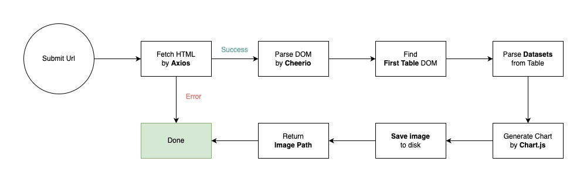

## How to Install
`npm install`
`Recommend: node 16`

## How to start
`npm run crawl <url>`

<strong>Example:</strong>
`npm run crawl https://en.wikipedia.org/wiki/Women%27s_high_jump_world_record_progression`

## Unit Test
`npm run test`

## Approach and solve

#### My approach to solving this problem is to use the libraries:
- Axios: to fetch html of the page
- Cheerios: to convert html to dom and support querying DOM elements
- Chart.js: to build charts and store them as images

#### The problem to be solved:

- Identify Table in html: take the first table in html
- Identify numeric column in table: use isNaN function to check - if there is no numeric column, it will notify
- Drawing a chart usually requires two parameters: Labels and Datasets. So I will use the numeric column as datasets and the first text column as labels.

#### Processing procedure:

- <b>Step 1</b>: Get url from command line and use axios to fetch html.
`If HTML cannot be fetched. It will not report invalid url and end the program.`
- <b>Step 2</b>: use cheerio to parse html into DOM Object.
- <b>Step 3</b>: Take the first table and parse the table data into Data Array. In this step, you need to identify the numeric column
`If you cannot identify the necessary data. It will not report invalid url and end the program.`
- <b>Step 4</b>: Use Chart.JS to draw chart and store it in Public Folder
- <b>Step 5</b>: Notify Image Path to user and end program.